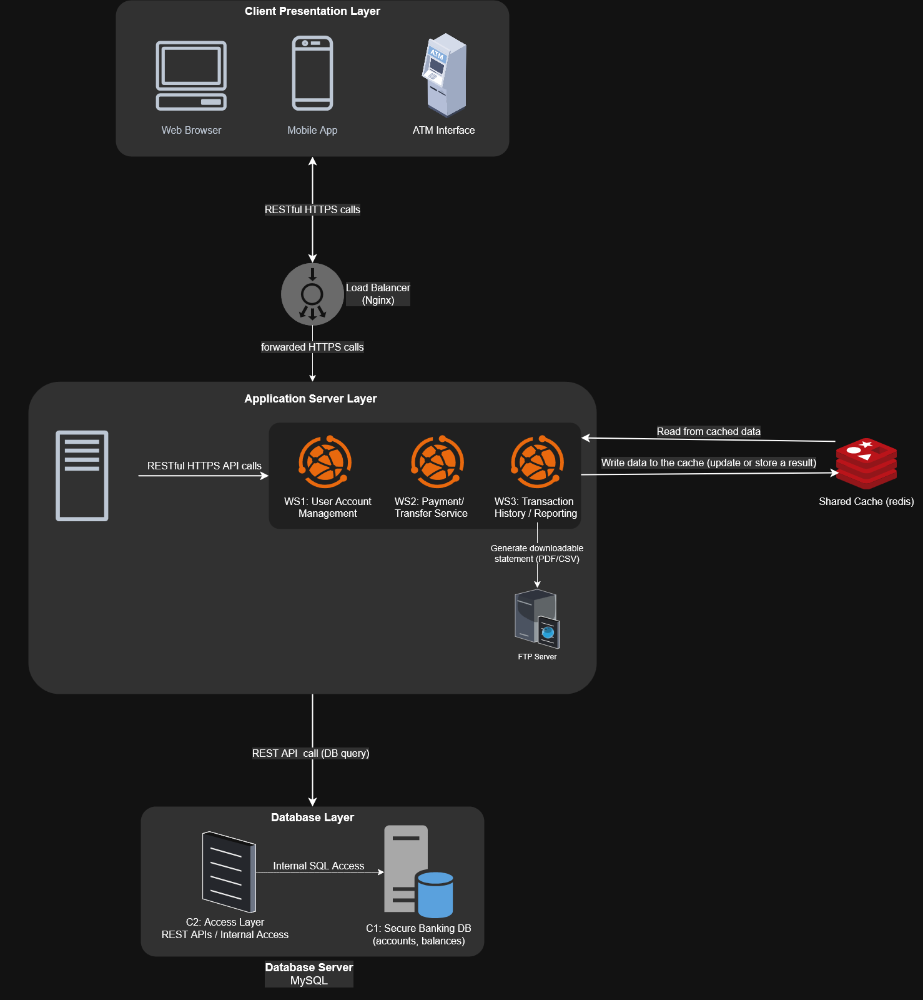
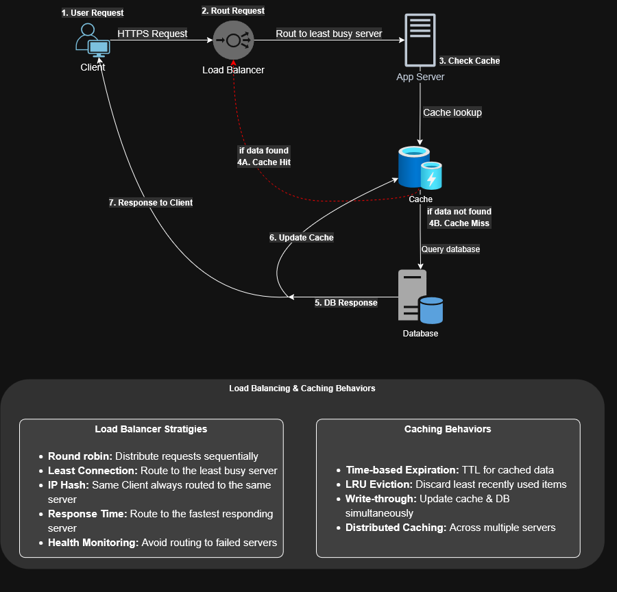
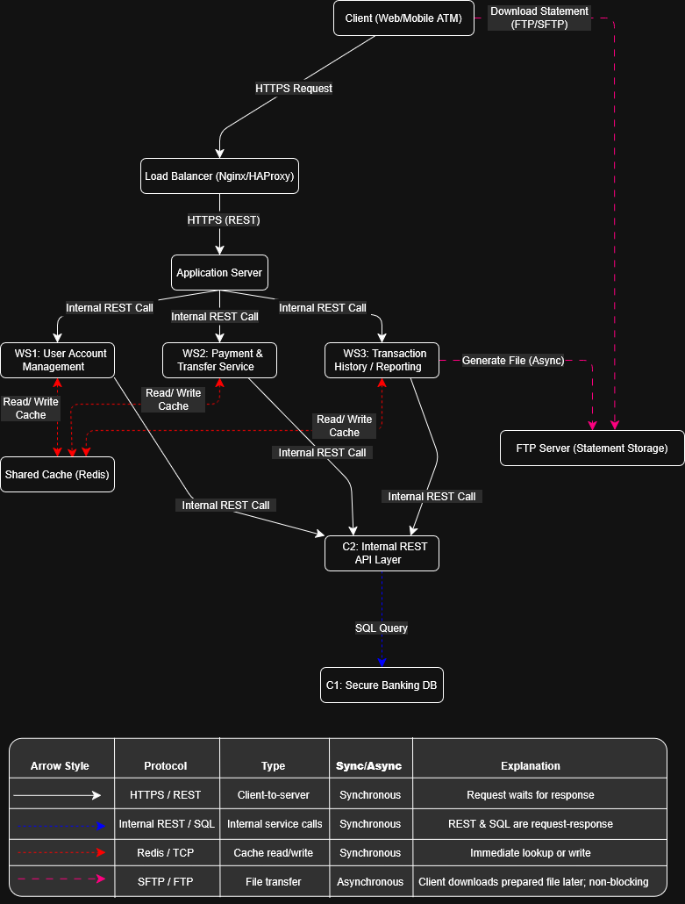

# Online Banking System / Digital Wallet – Software Architecture 

This repository is for the **Online Banking System / Digital Wallet** project
It contains detailed architecture diagrams, component documentation, communication protocols, and system design for a modern, scalable banking system.

---

## Contents

| File name                                                               | Description                                                 |
|-------------------------------------------------------------------------|-------------------------------------------------------------|
| `Part-One/Assignment 1_ SA  Sec sem 24-25.pdf`                          | Original assignment file                                    |
| `Part-One/Assignment #1-Submission.pdf`                                 | Submission file for Part 1                                  |
| `Part-One/BankingSystem-ClientServerBasedArchitecureDesign.drawio.png`  | Client-server architecture diagram (exported from draw.io)  |
| `Part-One/BankingSystem-WorkflowArchitecture.drawio.png`                | Request-to-reply workflow diagram (exported from draw.io)   |
| `Part-One/BankingSystem-CommunicationPatterns.drawio.png`               | Communication pattern diagram (exported from draw.io)       |

---

## Architecture Diagrams

### 1. Client-Server Architecture Design

> Covers major modules like client, load balancer, web services, DB, cache, FTP, and their interactions.

  

---

### 2. Workflow Architecture (Request to Reply)

> Shows a typical user request lifecycle and how the system responds, with cache behavior and DB interaction.

  

---

### 3. Communication Patterns (C&C View)

> Shows all communication protocols, connectors, and sync/async behavior across system components.

  

---

## Used Tools

- **draw.io** – For all diagrams  
- **Microsoft Word** – Report documentation  
- **Adobe** - Convert  Word document into a PDF format
