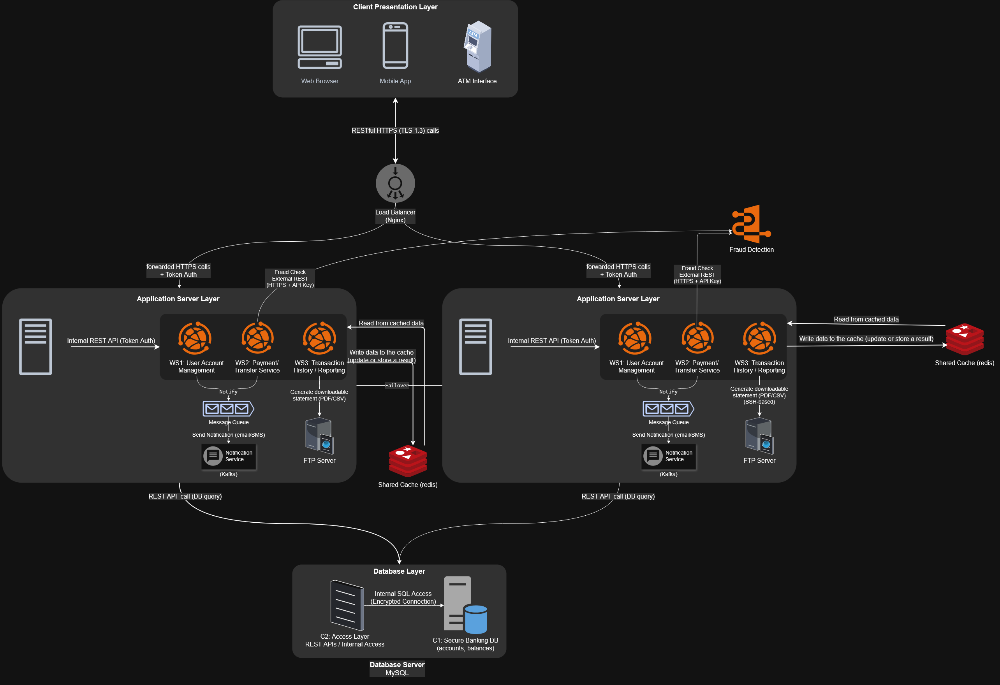
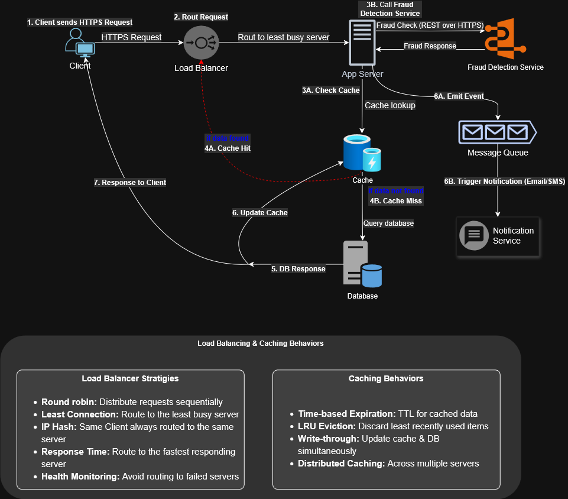
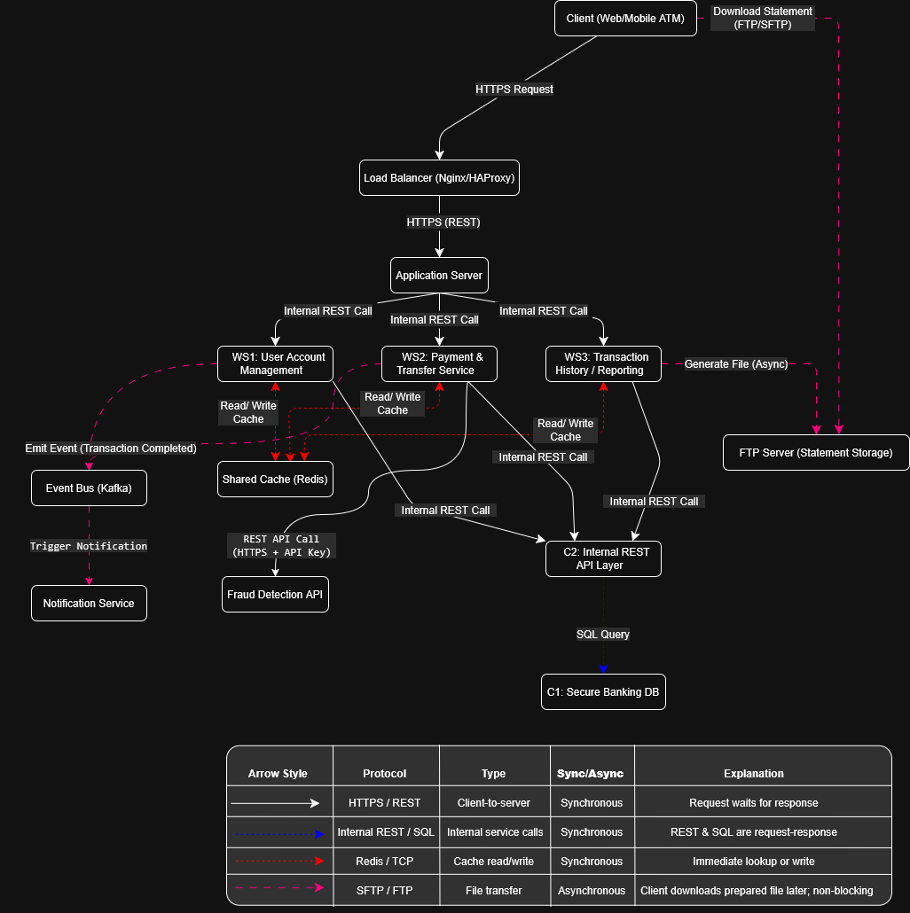

# Online Banking System / Digital Wallet – Software Architecture 

This repository contains the evolving architectural design of the **Online Banking System / Digital Wallet** project.  
It includes Part 1 and Part 2, showcasing system growth through secure APIs, event-driven notifications, fraud detection, and scalable microservices.

---

## Contents

| File name                                                               | Description                                                 |
|-------------------------------------------------------------------------|-------------------------------------------------------------|
| `Part-One/Assignment 1_ SA  Sec sem 24-25.pdf`                          | Assignment 1 instructions                                   |
| `Part-One/Assignment #1-Submission.pdf`                                 | Submission file for Assignment 1                            |
| `Part-One/BankingSystem-ClientServerBasedArchitecureDesign.drawio.png`  | Part 1: Client-server architecture diagram                  |
| `Part-One/BankingSystem-WorkflowArchitecture.drawio.png`                | Part 1: Workflow diagram (request to reply)                 |
| `Part-One/BankingSystem-CommunicationPatterns.drawio.png`               | Part 1: Communication protocols diagram                     |
| `Part-Two/Assignment_2_SA_24-25.pdf`                                    | Assignment 2 instructions                                   |
| `Part-Two/Assignment #2-Submission.docx`                                | Submission file for Assignment 2                            |
| `Part-Two/BankingSystem-ExtendedArchitecture-Part2.drawio.png`          | Part 2: Updated architecture diagram with new components    |
| `Part-Two/BankingSystem-WorkflowArchitecture-Part2.drawio.png`          | Part 2: Updated workflow with fraud check and notification  |
| `Part-Two/BankingSystem-CommunicationPatterns-Part2.drawio.png`         | Part 2: Updated communication protocols diagram             |

---

## Architecture Diagrams

### 1. Client-Server Architecture Design

> Covers major modules like client, load balancer, web services, DB, cache, FTP, and their interactions.

  

---

### 2. Workflow Architecture (Request to Reply)

> Shows a typical user request lifecycle and how the system responds, with cache behavior and DB interaction.

  

---

### 3. Communication Patterns (C&C View)

> Shows all communication protocols, connectors, and sync/async behavior across system components.

  

---

## Used Tools

- **draw.io** – For all diagrams  
- **Microsoft Word** – Report documentation  
- **Adobe Acrobat** - Convert  Word document into a PDF format
